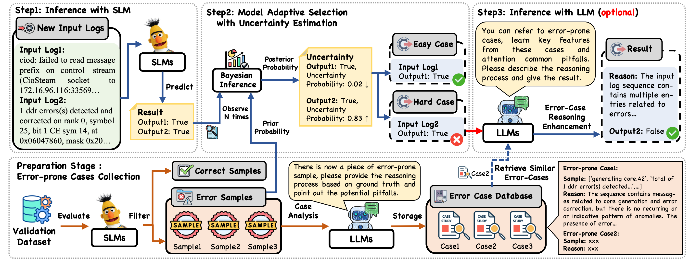

# AdaptiveLog: An Adaptive Log Analysis Framework with the Collaboration of Large and Small Language Model

This repository contains PyTorch implementation for AdaptiveLog: An Adaptive Log Analysis Framework with the Collaboration of Large and Small Language Model.

Automated log analysis is crucial to ensure high availability and reliability of complex systems. 
The advent of large language models (LLMs) in the domain of natural language processing (NLP) has ushered in a new era of language model-driven automated log analysis, garnering significant interest.
Within this field, two primary paradigms based on language models for log analysis have become prominent. Small Language Models (SLMs) (such as BERT) follow the pre-train and fine-tune paradigm, focusing on the specific log analysis task through fine-tuning on supervised datasets. On the other hand, LLMs (such as ChatGPT) following the in-context learning paradigm, analyze logs by providing a few examples in prompt contexts without updating parameters.
Despite their respective strengths, both models exhibit inherent limitations. 
By comparing SLMs and LLMs, we notice that SLMs are more cost-effective but less powerful, whereas LLMs with large parameters are highly powerful but expensive and inefficient.  
To maximize the strengths and mitigate the weaknesses of both models effectively, this paper introduces an adaptive log analysis framework known as AdaptiveLog. This framework collaborates an LLM and a small language model, strategically allocating the LLM to tackle complex logs while delegating simpler logs to the SLM.
Specifically, we propose an adaptive selection strategy to query LLM based on the uncertainty estimation of the SLM, where the LLM is invoked only when the SLM is uncertain.
In addition,  to enhance the reasoning ability of the LLM in log analysis tasks, we propose a novel prompt strategy by retrieving similar error-prone cases as the reference, enabling the model to leverage past error experiences and learn solutions from these cases.
We evaluate AdaptiveLog on different log analysis tasks, extensive experiments demonstrate that AdaptiveLog achieves state-of-the-art results across different tasks, elevating the overall accuracy of log analysis while maintaining cost efficiency.


## Usage

### Requirements

- transformers
- numpy
- torch
- huggingface-hub
- tokenizers
- scikit-learn
- tqdm
- requests

```
pip install -r requirements.txt
```

#### Structure of Files
We give the detailed code for Adaptivelog as an example in the LDSM task.

```
AdaptiveLog
 |-- datasets	# Downstream tasks datasets
 |-- ecr_results # Reults of ECR on different tasks
 |-- icl_results # Results of ICL on different tasks
 |-- sentence_transformers # We modified the code for evaluation and SentenceTransformerEnhance to implement AdaptiveLog
 |    |-- cross_encoder
 |    |-- datasets
 |    |-- evaluation
 |    |-- losses
 |    |-- models
 |    |-- readers
 |    |-- __init__.py
 |    |-- LoggingHandler.py
 |    |-- model_card_templates.py
 |    |-- SentenceTransformer.py 
 |    |-- util.py

 |-- ldsm_small_model_pred.py # evaluate SLM on the specific task

 |-- ldsm_small_model_train.py # fine-tune SLM on the specific task
 
 |-- ldsm_uncertain_pred.py # uncertainty estimation 
 
 |-- ldsm_uncertain_prob.py # cal prior and observe
 
 |-- query_ChatGPT.py # invoke the LLM
```


### Required pre-trained models
In our code, we use 'bert-base-uncased'  as the small language model, and you can use 'bert-base-uncased' directly or download [bert-base-uncased](https://huggingface.co/bert-base-uncased) into your directory.

### Fine-tuning BERT on the specific task

To fine-tune BERT , run:

```
python ldsm_small_model_train.py --train_data ./datasets/adaptive_ldsm/ldsm_hwswitch_train.json --dev_data ./datasets/adaptive_ldsm/ldsm_hwswitch_dev.json
```


### Evaluate

To evaluate the fine-tuned SLM on the specific task , run:

```
python ldsm_small_model_pred.py --test_data ./datasets/adaptive_ldsm/ldsm_hwswitch_test.json --pretrain_model ldsm_slm.pt
```

### Uncertainty Estimation

```
python ldsm_uncertain_pred.py --test_data ./datasets/adaptive_ldsm/ldsm_hwswitch_test.json --dev_data ./datasets/adaptive_ldsm/ldsm_hwswitch_dev.json --model_path ldsm_slm.pt --out_simple_path output/ldsm_hwswitch_simplesmaples.json --out_hard_path output/ldsm_hwswitch_hardsmaples.json 
```

### Query ChatGPT

```
headers = {
        "Authorization": "Bearer sb-$OPENAI_API_KEY",
        "Content-Type": "application/json",
}
python query_ChatGPT.py --data  ./datasets/adaptive_ldsm/ldsm_hwswitch_test.json
```

Note, for software logs downstream tasks, we collect datasets from [LogHub](https://github.com/logpai/loghub) and based on [LogPAI](https://github.com/logpai) to experiment


## License
MIT License

## Acknowledgements

Our code is inspired by [sentence-transformers](https://github.com/UKPLab/sentence-transformers/tree/master), [Hugging Face](https://huggingface.co/)

Our downstream tasks datasets are collected from [LogHub](https://github.com/logpai/loghub) and public documentation [Cisco](https://www.cisco.com/c/en/us/support/index.html) and [Huawei](https://support.huawei.com/enterprise/en/index.html).
